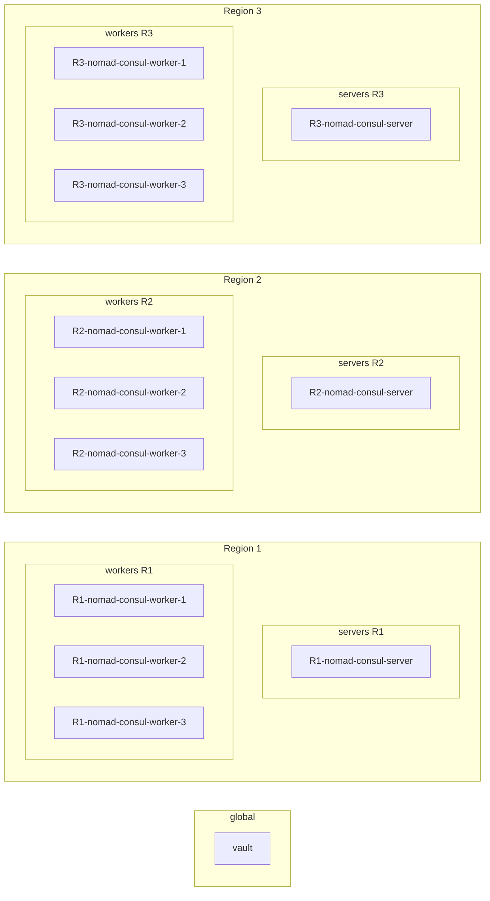

# Simple Demo

## Components
* Region 1 Vault seerver
* Region 1, 2 and 3 consul servers
* Region 1, 2, and 3 nomad servers
* 3 nomad workers in each region

## Components Diagram

```mermaid
flowchart LR
subgraph global
    vault
end
subgraph Region 1
    subgraph servers R1
        R1-nomad-consul-server
    end
    subgraph workers R1
        R1-nomad-consul-worker-1
        R1-nomad-consul-worker-2
        R1-nomad-consul-worker-3
    end
end
subgraph Region 2
    subgraph servers R2
        R2-nomad-consul-server
    end
    subgraph workers R2
        R2-nomad-consul-worker-1
        R2-nomad-consul-worker-2
        R2-nomad-consul-worker-3
    end
end
subgraph Region 3
    subgraph servers R3
        R3-nomad-consul-server
    end
    subgraph workers R3
        R3-nomad-consul-worker-1
        R3-nomad-consul-worker-2
        R3-nomad-consul-worker-3
    end
end

```